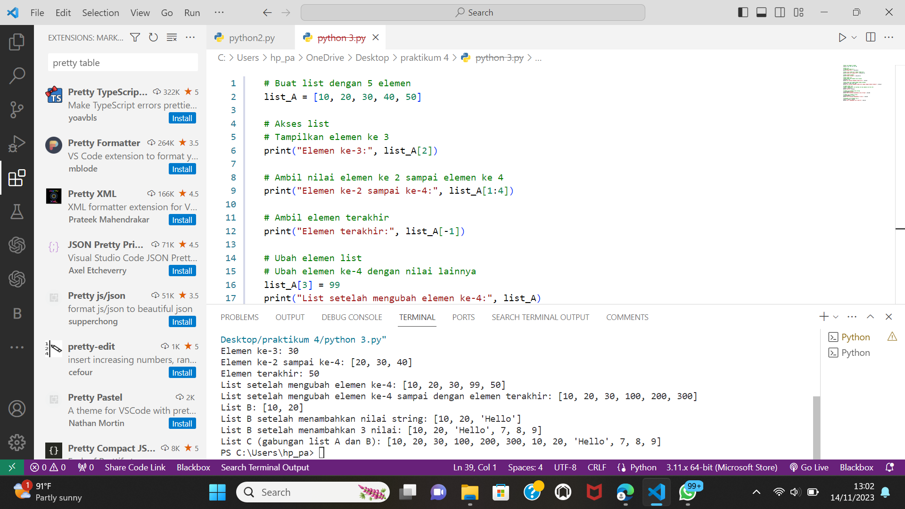
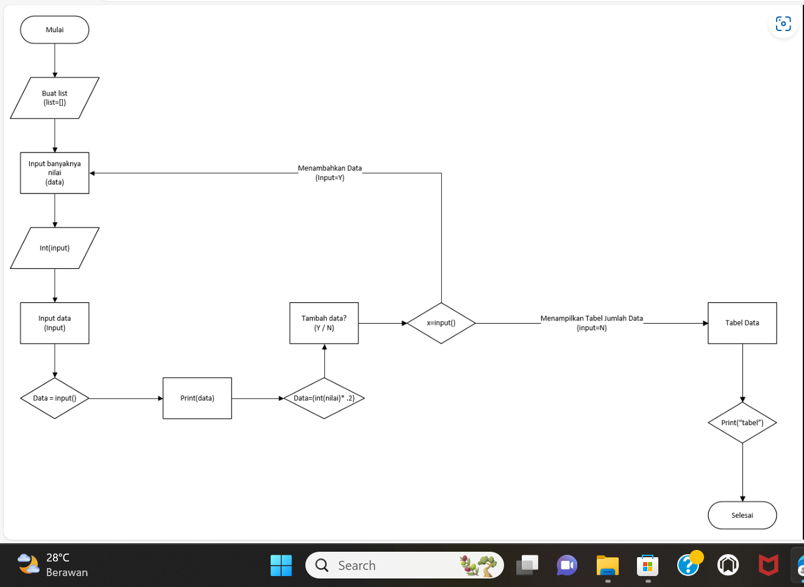

NAMA  :Fakhri afif M
 NIM   :312310632
 KELAS :TI.23.A6

# LATIHAN
• Buat sebuah list sebanyak 5 elemen dengan nilai bebas
 •akses list:
 • tampilkan elemen ke 3
 • ambil nilai elemen ke 2 sampai elemen ke 4
 • ambil elemen terakhir

 • ubah elemen list:
 • ubah elemen ke 4 dengan nilai lainnya
 • ubah elemen ke 4 sampai dengan elemen terakhir

 • tambah elemen list:
 • ambil 2 bagian dari list pertama (A) dan jadikan list ke 2 (B)
 • tambah list B dengan nilai string
 • tambah list B dengan 3 nilai
 • gabungkan list B dengan list A

# Hasil programnya 

# TUGAS PRAKTIKUM 4
Buat program sederhana untuk menambahkan data kedalam sebuah
list dengan rincian sebagai berikut:
 • Progam meminta memasukkan data sebanyak-banyaknya (gunakan
perulangan)
 • Tampilkan pertanyaan untuk menambah data (y/t?), apabila jawaban
t (Tidak), maka program akan menampilkan daftar datanya.
 • Nilai Akhir diambil dari perhitungan 3 komponen nilai (tugas: 30%,
uts: 35%, uas: 35%)
 • Buat flowchart dan penjelasan programnya pada README.md.

# Hasil programnya

# HASIL FLOWCHARTNYA

# penjelasan program
 1.Buatlah list berupa Nama, Nim, Nilai tugas, Nilai UTS, Nilai UAS
 2.Lalu inputlah Nama, Nim, Nilai tugas, Nilai UTS, Nilai UAS
 3.Jika ingin menambah list data ketik "ya" dan jikalau tidak ingin menambahkan list data ketik "tidak". Dengan perintah while jawab =="ya" dan if jawab =="tidak". Jawab input(("Tambah data y/t")).
 4.Gunakan perintah append pada Nama, Nim, Nilai tugas, Nilai UTS, Nilai UAS untuk menambahkan 1 item ke elemen terakhir.
Lalu mencari nilai akhir dengan perhitungan nilai tugas 30%, nilai uts 35% dan uas 35% , dengan perintah float
 5.Gunakanlah perulangan for, dengan perintah for i in range(len(Nama)):. Fungsi "len" ialah untuk mengembalikan panjang (jumlah anggota) dari suatu objek.
 6.Lalu cetak dengan perintah print(i+1,Nama[i],Nim[i],TGS[i],UTS[i],UAS[i],Nilaiakhir[i] )
 7.Selesai

